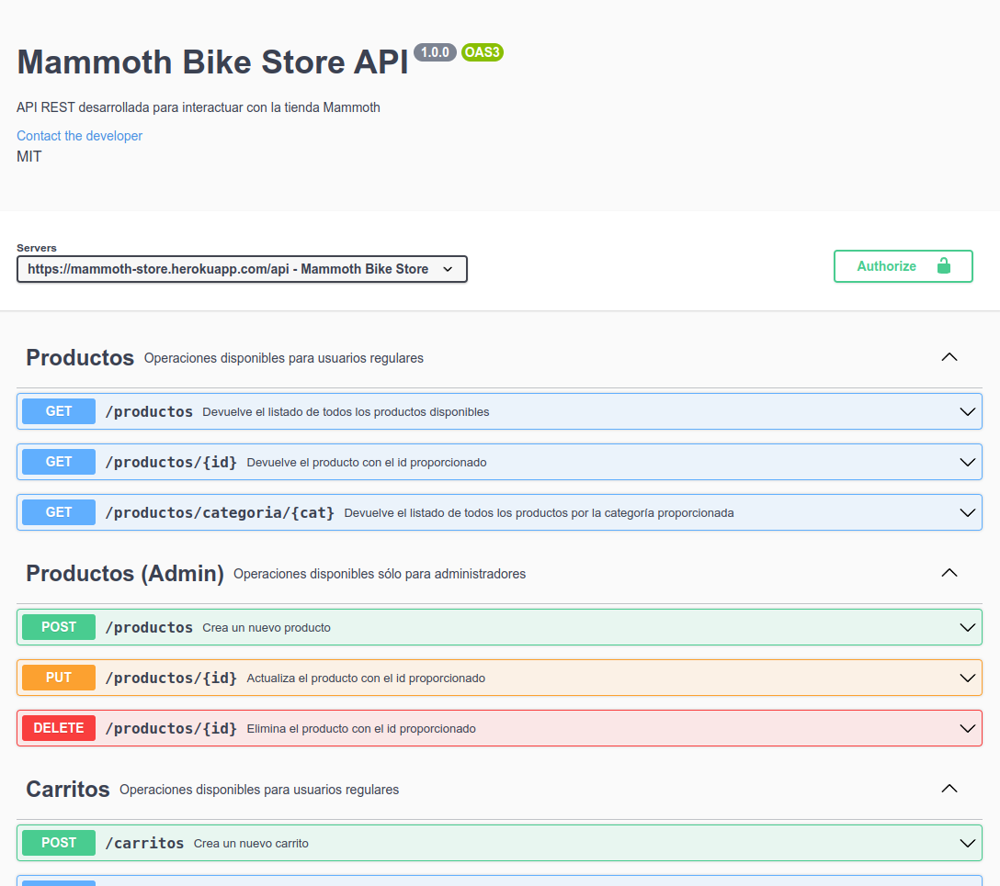

# Proyecto Final - Programación Backend

### CoderHouse

## Consigna

Para culminar con el proyecto final, vamos a realizar las últimas reformas al desarrollo backend e-Commerce para que quede estructurado de acuerdo a los criterios y mecanismos que fuimos aprendiendo en este último trayecto del curso.

- En primer lugar la aplicación de servidor debe tener sus capas MVC bien definidas y en archivos separados. Debe existir la capa de ruteo, el controlador, la capa de lógica de negocio con los casos de uso y las validaciones y la capa de persistencia con los DAOs/DTOs o Repositories necesarios para soportar el o los sistemas de persistencia elegidos.  
  En caso de ser más de uno, utilizar una factory para que podamos elegir el sistema de almacenamiento al inicio del servidor.

- El servidor debe disponer de configuraciones mediante variables de entorno, que permitan crear un ambiente para desarrollo y otro para producción, elegibles desde la variable de environment NODE_ENV al desplegar la aplicación. Como variables de configuración deberían estar el puerto de escucha del servidor, la persistencia elegida, el string de conexión a la base de datos (si hubiera varios sistemas de persistencia en base de datos considerar todos los casos y sus diferencias), API keys y todo lo que sea necesario que esté en un archivo protegido fuera del código del servidor. Pensar en utilizar bases de datos y servidores locales para la configuración de desarrollo.

- Se debe analizar que el hecho de incorporar un caso más de uso en la lógica del servidor, sea un proceso de agregar código y no de modificar el existente.

- Si agregamos un sistema más de persistencia, deberíamos agregar sólo el módulo nuevo y reformar la factory, mientras que resto del proyecto: router, controlador, lógica de negocio, validaciones y otros sistemas de persistencia no deberían sufrir modificaciones para soportar la nueva función.

- El código debe quedar bien tabulado, legible, ordenado y comentado ni por exceso ni por defecto.

- Las funciones o clases que se por sí solas expliquen su misión, no necesitan ser explicadas (salvo que amerite por complejidad).

- Para concluir, subir el desarrollo completo a Heroku o algún PASS de preferencia, seleccionando la configuración a producción de modo de utilizar los parámetros adecuados de funcionamiento y la persistencia en la nube a través de bases de datos como servicio (DBaaS).

## Introducción

Esta entrega forma parte del trabajo final correspondiente al curso de **Programación Backend** dictado por **CoderHouse**.  
Se trata del desarrollo de una tienda virtual para una bicicletería (Mammoth).

Por un lado se encuentra el desarrollo de la **API REST** del ecommerce y por otro el desarrollo de un **servidor web** que provee las vistas de frontend necesarias para simular el proceso de compra y probar la funcionalidad de la API.

Esta entrega final parte de las mismas funcionalidades que las anteriores, pero con los siguientes cambios principales:

- Refactorizado del código con división por capas (ruteo, controlador, lógica de negocio y persistencia)
- Tests de endpoints y funcionales
- Documentación de la API REST con **Swagger**

### Deploy en Heroku (Temporal):

https://mammoth-store.herokuapp.com

## Ejecución

Luego de clonar o descargar el repositorio e instalar todas las dependencias con `npm install`, existen dos comandos para levantar el proyecto.
Para levantarlo en "modo de desarrollo" junto a nodemon, utilizar `npm run dev`. De lo contrario, para ejecutarlo en "modo producción", utilizar `npm start`.

El servidor permite seleccionar entre 8 diferentes modos de persistencia de datos (ver más abajo en **Selección del modo de persistencia de datos**), a través de la variable de entorno `PERS`. También se le puede pasar el tipo de entrono de ejecución a través de la variable de entorno `NODE_ENV`. En modo `NODE_ENV=production`, no carga el modulo **dotenv**, necesitando configurar las variables de entorno desde la plataforma del servidor donde este alojado el deploy. A continuación se muestra un ejemplo (linux) de ejecución en modo **desarrollo** y persistencia **MariaDB**:

```sh
$ PERS=mariadb npm run dev
```

Adicionalente, se puede pasar por parámetros de argumento dos opciones:
| Opción | Valor | Defecto |
| ------ | ----------------------- | --------------------------------------------------------------------------------------------------------------------------------------------------------------------------------------------------------------------------- |
| `-p --port --PORT` | Número de puerto de escucha del servidor | 8080 |
| `-m --mode --MODE` | Módo de ejecución del servidor. `FORK` o `CLUSTER` | FORK |

Por último un ejemplo de configuración del scrip `start` del `package.json` para unos de los deploys que utilicé en **Heroku**

```json
{
  ...
  "main": "src/index.js",
  "type": "module",
  "scripts": {
    "start": "node src/. --mode CLUSTER",
    ...
  }
  ...
}
```

## Información general

### Selección del modo de persistencia de datos

Como se mencionó más arriba, existen 8 variantes para elegir el modo de **peristencia**:

| Key             | Descripción                                               |
| --------------- | --------------------------------------------------------- |
| `mem`           | Persistencia en memoria del servidor (Opción por defecto) |
| `fs`            | Persistencia usando el sistema de archivos                |
| `mariadb`       | Peristencia en base de datos MariaDB local                |
| `cleardb`       | Persitencia en base de datos MySQL de ClearDB (Heroku)    |
| `sqlite3`       | Persitencia en base de datos Sqlite3                      |
| `mongodb`       | Persistencia en base de datos MongoDB local               |
| `mongodb_atlas` | Persistencia en base de datos MongoDB Atlas               |
| `firebase`      | Persistencia en base de datos Firestore (Firebase)        |

Esta selección se hace pasando el valor correspondiente de la key en la variable de entorno `PERS` a la hora de levantar el servidor.
La forma de hacerlo depende de la terminal que se esté ejecutando. Un ejemplo desde linux sería:

```sh
$ PERS=firebase node .
```

**NOTA**: Las credenciales y valores de configuración de las bases de datos se encuentran en el archivo `config.js` y se toman desde variables de entorno.
El archivo `.env` con dichos valores será enviado de manera privada al tutor o profesor encargado de la corrección.

### Arquitectura en capas

Tomando como base la estructura de carpetas de la anterior entrega, refactoricé el código para dividir el proyecto en capas, dando lugar a la siguiente estructura de carpetas **principales**:

```
src/
├── controllers/
├── middlewares/
├── models/
│   ├── baseDAOs/
│   ├── DAOs/
|   |   ├── carts/
|   |   ├── messages/
|   |   ├── orders/
|   |   ├── products/
|   |   ├── users/
│   ├── DTOs/
│   ├── entities/
│   ├── schemas/
├── routes/
├── services/
├── views/
|...
```

- routers: definición de las rutas de la app (tanto rutas de la API como del Webserver). Se dividen de acuerdo a las funcionalidades. En estas se llaman a los respectivos controladores y middlewares.
- middlewares: intermedian en las peticiones hacia el servidor y realizan diferentes tipos de acciones según su funcionalidad (autenticación, subida de archivos, login y registro de usuarios, validaciones de datos recibidos, etc)
- controllers: reciben las peticiones y manejan el flujo de las respuestas, pasando los datos a la capa de servicio y esperando por una respuesta de la misma, para luego devolver una respuesta a la capa de presentación.
- services: Es donde se encuentra la lógica de negocio de la app y se llevan a cabo las validaciones que puede solicitar algún middleware o la misma capa. Se comunica con la capa de persistencia pasándole los datos y esperando por una respuesta de la misma. Una vez procesados los datos, son devueltos a la capa de ruteo (controllers).
- models: Aqui está toda la lógica relacionada a la interacción con la base de datos o sistema de persistencia. Se encarga de guardar y recuperar información de la BD.
- views: Lugar donde residen las vistas que forman la capa de presentación.

Toda la lógica de negocio fue trasladada desde los controladores (en donde residía hasta ahora) a la capa de servicio. Se dividieron en archivos según la funcionalidad que se encuentran dentro de la carpeta `services`.  
También la lógica de negocios asociada a las validaciones que ofrecen los middlewares fue traslada allí.  
Es está capa la que se comunica con el modelo, evitando el salto de capas. Cada capa realiza su tarea y se la comunica a la capa adyacente ya sea hacía arriba o abajo de la arquitectura.
Tanto controladores como middlewares (que se encuentran en la capa de ruteo), reciben la petición y pasan los datos a la capa de servicio (cuando corresponde) esperando por su respuesta.

Para el caso de los **sockets** ocurre algo similar, donde cada evento tiene asociada una función (controlador). Éste recibe la data y se comunica de ser necesario con la capa de servicio y esta a su vez con el modelo.

Dentro de la carpeta `models`, se encuentran:

- `BaseDAOs`: DAOs para las distintas persistencias, a partir de los cuales se extienden los DAOs particulares
- `DAOs`: aquí se encuentran los DAOs de las distintas persistencias agrupados por entidades junto a la **Factory** correspondiente.
- `DTOs`: se ubican los DTOs separados por entidades
- `entities`: clases que definen las entidades y sus validaciones
- `schemas`: schemas de **mongoose**
- `index.js`: archivo de índice que exporta los DAOs. Desde este archivo se importan las distintas **Factories** y se les pide el DAO correspondiente para luego exportarlos.

Cada clase "DAO" asociada a las distintas entidades y variable según el tipo de persistencia, posee los mismos métodos para poder independizarlas del resto de la lógica propia de la API.  
 Estos métodos están estructurados para devolver el mismo formato de datos y contemplar los mismos tipos de respuestas en todos los casos. Así no se generan riesgos de romper el código por manejar respuestas diferentes entre estos diferentes casos de persistencia.

Cada **Factory** toma como parámetro la persistencia elegida `PERS` y al llamar a su método `get`, nos devuelve el DAO correspondiente a dicha persistencia.

Los DAOs implementan el patrón **singleton** para impedir crear más de una instancia de estos mecanismos de acceso a los datos.

Se refactorizó la lógica de validaciones de datos, usando métodos estáticos respectivos de cada entidad. Para facilitar y mejorar la lógica de dichas validaciones se implementó la librería **Joi**

Finalmente, moví los dos tipos de errores 404 a su respectivo controlador.

### Vistas

Existe un conjunto de vistas que provee el servidor web. Podemos dividirlas en 3 grupos:

- Autenticación
- Usuario
- Administrador

#### Vistas de autenticación

- **/login** : Permite el login del usuario mediante sus credenciales o usando la cuenta de Google. Es la vista que nos ofrece por defecto al entrar al sitio en caso de no estar ya logueados con una sesión activa. No se permite acceder a la vista si el usuario se encuentra ya logueado.

- **/login-error** : somos redirigidos aquí en caso de haber un error durante el proceso de login. Se muestra un mensaje haciendo referencia al error encontrado y nos da la opción de volver a la vista de login.

- **/register** : Permite el registro de un nuevo usuario mediante un formulario donde se deben completar sus datos con la opción de poder subir una imagen a elección para el avatar del usuario. No se permite acceder a la vista si el usuario se encuentra ya logueado.

- **/register-error** : somos redirigidos aquí en caso de haber un error durante el proceso de registro. Se muestra un mensaje haciendo referencia al error encontrado y nos da la opción de volver a la vista de registro.

- **/logout** : nos da un saludo personalizado luego de desloguearnos del sitio y nos redirige al inicio en 5 segundos.

#### Vistas de usuario (estándar)

Se puede acceder a ellas siendo un **usuario estándar**:

- **/** : Es el home del sitio, en donde el usuario puede ver el catálogo completo de productos, junto con un sistema de filtros para ayudar en su elección. En el header cuenta con un acceso a su carrito de compras y un indicador animado de los productos que va sumando al mismo. También dentro de esta sección dispone de accesos para **mi cuenta, sala de chat y logout** junto al avatar personalizado del usuario (en caso de haber elegido uno al registrarse o contar con uno de la cuenta de Google)

- **/producto/:id** : Se visualiza el detalle del producto según su id.

- **/categoria/:cat** : Se visualizan todos los productos pertenecientes a una determinada categoría, junto al sistema de filtros mencionado.

- **/carrito** : Detalle de los productos que fue seleccionando el usuario. Desde aquí se puede vaciar el carrito, eliminar un producto del mismo o variar su cantidad siempre dentro de los límites permitidos por el stock. Además se puede continuar con la compra hacia el checkout.

- **/micuenta** : Muestra una vista personalizada con datos del usuario y permite acceder al resto de la información de la cuenta registrada como también al historial de órdenes de compra del mismo.

- **/chat/:email?** : Acceso a la sala de chat en donde se puedes hacer consultas a la empresa (**Mammoth Bike Store**) y visualizar todo el hilo de consultas de los demás usuarios. Si se accede a la ruta filtrada por el usuario actual, solo se visualizan los mensajes del usuario seleccionado por su **email**, y las respuestas de la empresa hacia el mismo. Utiliza **websockets**.

- **/checkout** : Resumen de compra en donde se pide completar una serie de datos a fin de generar la orden de compra en caso de aceptarla.

- **/checkout/ok** : Pantalla que se muestra con información en caso de que el proceso de generación de la orden ocurra correctamente.

- **/checkout/error** : Pantalla que se muestra en caso de haber algún problema al generar la orden de compra.

#### Vistas de administrador

Solo disponible para **usuarios con permisos de administrador**:

- **/productos/admin** : Panel de productos del administrador, donde está el listado de los mismos y se puede ver, modificar, crear, y borrar productos. Filtrando la búsqueda por distintas maneras. Desde el header se puede acceder a panel de carritos y chat del administrador.

- **/carritos/admin** : Se accede al listado de todos los carritos actualmente almacenados en la BD. Permite recorrer cada carrito, viendo la información de ellos como fecha de creación, usuario propietario y productos seleccionados. Se puede eliminar por completo el carrito, o los productos individuales del mismo.

- **/chat/admin** : Esta vista es el panel de administrador del chat. En ella el administrador/empresa puede enviar:

  - mensajes generales (selección nula de destinatario).
  - mensajes a un determinado usuario (seleccionando el mismo haciendo click sobre alguno de sus mensajes o introduciendo su email manualmente)
  - mensajes respuestas a determinados mensajes puntuales, haciendo click sobre el botón que aparece a la derecha de cada mensaje al que se le hace hover. En este caso la respuesta cita el mensaje de origen.

  Utiliza **websockets**.

### API REST

Independientemente del modo de persistencia elegido, cada endpoint devuelve el mismo formato de datos.

Todas las rutas poseen un middleware de verificación de usuario logueado `isAuthApi`, por lo que no son accesibles sin esta condición.

A continuación, se lista un resúmen de los endpoints de la API REST.

Consiste en las siguientes rutas:

#### Router /api/productos

| Método | Endpoint                | Descripción                                                                                                  |
| ------ | ----------------------- | ------------------------------------------------------------------------------------------------------------ |
| GET    | **/api/productos/:id?** | Me permite listar todos los productos disponibles ó un producto por su id                                    |
| POST   | **/api/productos/**     | Para incorporar productos al listado **(disponible solo para administradores)**                              |
| PUT    | **/api/productos/:id**  | Actualiza un producto por su id. Admite actualizaciones parciales **(disponible solo para administradores)** |
| DELETE | **/api/productos/:id**  | Borra un producto por su id **(disponible solo para administradores)**                                       |

#### Router /api/carritos

| Método | Endpoint                                 | Descripción                                                                                                                                                                                                                                                                                                                                                         |
| ------ | ---------------------------------------- | ------------------------------------------------------------------------------------------------------------------------------------------------------------------------------------------------------------------------------------------------------------------------------------------------------------------------------------------------------------------- |
| GET    | **/api/carritos/**                       | Obtengo el listado con los ids e infomación de los carritos existentes **Disponible solo para administradores**                                                                                                                                                                                                                                                     |
| POST   | **/api/carritos/**                       | Crea un carrito y devuelve su id                                                                                                                                                                                                                                                                                                                                    |
| GET    | **/api/carritos/usuario**                | Obtengo el carrito del usuario logueado en caso de tener uno                                                                                                                                                                                                                                                                                                        |
| DELETE | **/api/carritos/:id**                    | Vacía un carrito y lo elimina por si id                                                                                                                                                                                                                                                                                                                             |
| GET    | **/api/carritos/:id/productos**          | Me permite listar todos los productos guardados en el carrito con determinado id                                                                                                                                                                                                                                                                                    |
| POST   | **/api/carritos/:id/productos**          | Para incorporar productos al carrito por su id de carrito y el id de producto y cantidad (en el cuerpo de la petición)                                                                                                                                                                                                                                              |
| PUT    | **/api/carritos/:id/productos**          | Para actualizar un producto del carrito por su id de carrito y los datos a actualizar del producto (en el cuerpo de la petición). Aparte de agregar y borrar productos del carrito de manera completa, con esta funcionalidad, puedo subir o bajar la cantidad del mismo desde el carrito, es decir, modificar su cantidad a otro valor dentro del rango permitido. |
| DELETE | **/api/carritos/:id/productos/:id_prod** | Eliminar un producto del carrito por su id de carrito y de producto                                                                                                                                                                                                                                                                                                 |

#### Router /api/ordenes

| Método | Endpoint                 | Descripción                                                                                                         |
| ------ | ------------------------ | ------------------------------------------------------------------------------------------------------------------- |
| POST   | **/api/ordenes/**        | Crea una nueva orden de compra para el usuario logueado en base al contenido de su carrito y los datos del checkout |
| GET    | **/api/ordenes/usuario** | Obtengo el listado de órdenes del usuario logueado                                                                  |

#### Swagger

Para una mayor comprensión del funcionamiento de los endpoints de la **API REST**, desarrollé la documentación utilizando **Swagger** y sirviendo la misma en la ruta **/api-docs**.

En ella se encuentran detallados cada endpoint junto a su método, esquema de solicitudes y respuestas respectivas. También se ejemplifica cada una de estas situaciones.

Deshabilité las pruebas "try it out", ya que es una API interna del e-commerce con sus respectivas validaciones de roles de usuarios y autenticación. Por lo que considero que no se aplica la posibilidad de pruebas "abiertas".

A continuación se muestra una captura a modo de ejemplo de esta documentación

<div align="center">
  
</div>
<br/>

### Autenticación y sesiones

Las sesiones del usuario se almacenan en **MongoDB** en la colección `sessions` utilizando el modulo `connect-mongo`.

Se aplicaron estrategias de autenticación tanto al **login** como al **registro**, por lo que luego de completar con éxito cualquiera de ellos, ya se logra autenticar al usuario y redirigir a la vista principal.

En caso de estar logueado, evito poder acceder directamente a la vista de login o registro, redirigiendo a la vista principal para sugerir realizar el **logout** previo a ello.

El formulario de registro incluye la posibilidad de seleccionar y subir una imagen a modo de avatar. El **tamaño máximo** que impuse es de **1MB**, para evitar la sobrecarga del servidor y posibles ataques de **denegación de acceso**. Existen validaciones tanto en el front como en el back respecto al tamaño y un correspondiente manejo de errores de `multer` a tal fin. También elimino dicha imagen si luego ocurre un error en el flujo del proceso asociado.  
El formulario también incluye el ingreso de la contraseña por segunda vez, para su verificación.

Aparte de las validaciones en el front previo a enviar los datos al servidor del formulario de registro, se produce una segunda validación del lado del servidor mediante un **middleware** `validateRegisterPost` a fin de asegurarse guardar en la BD los datos de manera correcta.

El password del usuario se guarda encriptado, para lo que se utilizó la librería `bcrypt` en su versión **asíncrona** a fin de no perjudicar el rendimiento del servidor con funciones bloqueantes. Esto se debe a que el hash realizado por bcrypt requiere un uso intensivo de la CPU, por lo que la versión de sincronización bloqueará el bucle de eventos y evitará que la aplicación atienda otras solicitudes o eventos entrantes. La versión asíncrona utiliza un grupo de subprocesos que no bloquea el bucle de eventos principal.

Se pasan mensajes a través de la sesión activando la opción `failureMessage` y `successMessage` del método `authenticate` de passport. Luego en la vista destino se recibe dicha información y se procesa debidamente (reseteando el mensaje), para mostrar mensajes personalizados.  
En un principio, use la funcionalidad incorporada de éste mismo método para setear esos mensajes usando el modulo `connect-flash` mediante las opciones `failureFlash` y `successFlash`. Pero noté que presentaba mayores problemas de carrera al usar **MongoDB Atlas** como “store” para las sesiones. Esto, por los tiempos asíncronos involucrados en las operaciones de escritura y posterior lectura al redirigir a la siguiente vista. Es más sencillo y prolijo su uso, pero decidí usar el pasaje por `req.session` y trabajar manualmente el reseteo de los mensajes luego de usarlos.

Incorporé un botón de inicio de sesión con cuenta de **Google** y la correspondiente `Strategy` de **passport**.

Para la serialización y des-serialización del usuario en la sesión, utilicé unas funciones que contemplan ambos mecanismos diferentes. En el caso de tratarse del mecanismo de usuario y contraseña, utiliza el id para serializar y des-serializar el usuario. Si se trata del usuario obtenido por la estrategia de **Google**, no produce ninguna serialización ni des-serialización correspondiente (Ejemplo sencillo).

Tras autenticarse e ingresar a la pagina principal, se cargan los datos del usuario según el método de autenticación empleado.

Junto con el logout, se procede a destruir la sesión y borrar las cookies respectivas del navegador del usuario, ayudando a evitar ataques de perdida de autenticación y/o control de acceso (**OWASP A2:2017 y A5:2017**).

### Middlewares y validaciones

Cree varias funciones de middleware tanto para la **API** como para el **Web Server**.

Estas funciones ayudan al proceso de validar la autenticación y autorización del usuario (`auth`), como también los valores que éste envía a los distintos endpoints (`validateData` y `validateWebData`).

Dentro del grupo de middlewares de autenticación y autorización se evalúa que el usuario se encuentre autenticado, si tiene el rol de administrador y si el carrito que intenta operar es el que le fue asignado y le pertenece. Se encuentran versiones tipo API o tipo WEB variando en tipo de respuesta en un caso u otro.

En el grupo de middlewares para validar los datos recibidos, existen un conjunto variado de funciones para verificar que los datos que llegan a los distintos endpoints estén dentro de lo esperado, y sino devuelvo algún tipo de mensaje de error o redirección.

También en las entradas críticas, provoco un escape de caracteres especiales a fin de evitar ataques por inyección de código o de secuencia de
comandos en sitios de origen cruzado (XSS) (**OWASP A1:2017 y A7:2017**).

### Cluster

Hice algunas modificaciones en el código para solucionar el problema que se presenta con la librería **socket.io** al seleccionar el funcionamiento del servidor en modo clúster.
Esté problema da como resultado que no funcione la comunicación por **Websockets** en modo clúster.

El problema radica en dos cuestiones:

- El método de sondeo largo http que opera al inicio de la conexión hasta establecerse el intercambio por websocket, provoca múltiples solicitudes http, que van a parar a distintos servidores del clúster, "rompiendo" la comunicación con el servidor original.

- Los mensajes entre un cliente y un servidor quedan confinados entre ellos, y los demás servidores del clúster no se enteran de ellos

Para solucionar el primer problema, deshabilite el sondeo largo http del cliente. También puede solucionarse con sticky sessions, manteniendo la conexión de un determinado cliente con un mismo servidor.

Para solucionar el segundo punto, utilicé un adaptador para el clúster, mediante la librería `@socket.io/cluster-adapter`. Con este se consigue que cuando un servidor envía un mensaje a un grupo o todos los sockets, este mensaje también es enviado a los demás servidores del clúster y remitido a sus respectivos clientes.

### Mensajería

Para el envío de emails, se utilizó la librería `nodemailer`.

Se producen los siguientes envíos:

- email al **administrador** al registrarse un nuevo usuario con los datos del registro
- email al **administrador** al generarse una nueva orden de compra con los datos del pedido y del usuario
- email al **usuario** al generarse una nueva orden de compra con los datos del pedido

Para el envío de mensajes SMS y de WhatsApp, se utilizó la librería `twilio`.

Se producen los siguientes envíos:

- WSP al **administrador** al generarse una nueva orden de compra con una referencia al usuario propietario
- SMS al **usuario** al generarse una nueva orden de compra indicándole que fue recibida y se encuentra en preparación.

En la carpeta `docs` se encuentran 5 capturas de pantalla a modo de ejemplo de los casos anteriores.

E-mail nuevo registro (Administrador)

<div>
  
</div>
<br/>

E-mail nueva orden (Administrador)

<div>
  
</div>
<br/>

E-mail nueva orden (Usuario)

<div>
  
</div>
<br/>

SMS al generar pedido (Usuario)

<div>
  
</div>
<br/>

WSP al generar pedido (Administrador)

<div>
  
</div>
<br/>

### Logs

Se utilizó la librería `winston` para generar logs eficientes por consola y archivos. Evitándose el uso del console.log que por su naturaleza síncrona trae problemas de rendimiento.

Generé dos alternativas de logger según el entorno de ejecución (production o development).

Cada logger tiene asociados distintos transportes personalizados ya sea por consola o archivo. La personalización del formato de salida varía según el entorno, para adaptarse mejor a las necesidades y rendimiento.

Para el entorno de desarrollo el nivel se establece en "debug", mientras que en producción se lo hace en "info". En desarrollo hay dos salidas por archivo con niveles "warn" y "error" respectivamente, mientras que en producción hay una única salida por archivo de nivel "warn"

Se hace un registro de tipo "warn" al pedir rutas no implementadas, no autorizadas e intentos de login fallidos, a fin reducir los ataques por registro y monitoreo ineficientes (**OWASP A10:2017**)

### Análisis de performance

Se realizó un test de stress sobre el enpoint **/api/productos** que nos devuelve el listado de todos los productos, comparando su comportamiento en modo "FORK" vs modo "CLUSTER". Se eligió como persistencia a **MongoDB local**.

El test se realizó con:

- **Artillery** con 100 usuarios virtuales concurrentes y cada uno realizando 200 peticiones consecutivas.
- **Autocannon** con 100 usuarios concurrentes realizando peticiones consecutivas durante 20 segundos

Los resultados se encuentran dentro de la carpeta `docs`.

Autocannon - **Fork**

<div>
  
</div>
<br/>

Autocannon - **Cluster**

<div>
  
</div>
<br/>

Se visualiza claramente como en modo "CLUSTER" el rendimiento es sustancialmente mayor:

- mayor cantidad de peticiones/seg
- menor tiempo medio de respuesta
- menor tiempo medio de sesión por usuario virtual

Esto es dado que se utilizan todos los núcleos del procesador para ejecutar instancias del mismo servidor que pueden atender más peticiones en paralelo al hacer un mejor uso de los recursos del computador.

También si hizo un análisis de performance en el mismo endpoint y modo fork con **0x** y **Node inspect**. Del análisis de ambos puede evidenciarse el comportamiento asíncrono del servidor lo que favorece a un mayor rendimiento de la app.
En la carpeta `docs` se encuentra el gráfico de flama de **0x** junto a la tabla y gráfica de **Node inspect**. En el gráfico de flama no se aprecian importantes "focos calientes".

<div align="center">
  
</div>
<br/>

Los más calientes pertenecen a la serialización y des-serialización asociada a MongoDB, pero puede comprobarse en conjunto con los datos de **Node inspect** que el tiempo propio de dichas funciones (permanencia en la cima del stack) no es tan importante. En la gráfica del proceso de **Node inspect** se aprecian los típicos picos de las funciones asíncronas.

<div align="center">
  
</div>
<br/>

### Tests

Se puede ejecutar una suite de tests con **Mocha** de la **API de productos**. Para ello, utilizar el comando `npm test`.

> > > **Nota:** previo a la realización de los tests, deshabilité las validaciones de autenticación y validación de roles de usuarios sobre las respectivas rutas, de lo contrario, los test arrojarán error de autenticación.  
> > > Esto a modo de facilitar las pruebas, ya que los objetivos de estos tests no se tratan sobre el sistema de validación.

Un ejemplo desde linux para ejecutar los test con **MongoDB** como persistencia, sería:

Ejecución del servidor

```sh
$ PERS=mongodb npm start
```

Ejecución del test

```sh
$ npm test
```

A fin de generar datos de productos para el test utilicé el módulo de **faker** para construir una función generadora que se importa para los tests.

Realicé una serie de tests con el framework de testeo **Mocha** junto con **supertest** como cliente http y **chai** para escribir las aserciones.  
Los tests se dividen en dos grupos principales:

- Test a endpoints de la API de productos: Se prueba cada endpoint según los distintos tipos de respuestas en función del estado de la petición.
- Test funcional de la API de productos: Se hace una simulación encadenada de peticiones, probando la funcionalidad en conjunto de la API. Es similar al recorrido que se hace en el test "manual".

En los test se usan los hooks de **before** y **after** para preparar las condiciones previas a los bloque de pruebas y luego para realizar una limpieza de los datos residuales (Ej: productos creados en BD)

Dentro de la carpeta `tests` se encuentra en un archivo .png donde se muestra una captura de pantalla de los resultados arrojados por consola.

<br/>
<div align="center">
  
</div>

## Notas varias

- Se utilizó la librería **minimist** para procesar los argumentos de entrada, junto a las opciones de "alias" y "default" para el puerto y modo de operación.

- En el panel de administración de productos, incorporé la posibilidad de subir una imagen desde el formulario. Entonces puedo elegir entre colocar una url para el thumbnail, o tomar una imagen existente y asociar su ruta desde la carpeta en donde se sube. Si subo el archivo le da prioridad a esta ruta, por más que haya colocado una url a mano.

- Antes de agregar o modificar productos del carrito, valido el stock actual y solo permito la acción, si la cantidad en el carrito va a ser menor o igual al stock. Sino muestro un mensaje de error indicando el problema y notificando el stock del producto.

- Normalización: Analicé la normalización para la transmisión de los mensajes, pero para la estructura de datos que tengo en este caso, no resulta conveniente la normalización. Por el contrario, se obtienen datos con mayor volumen que el original.
  Esto se debe a que no existe una redundancia de información en la data que haga necesario la normalización, ni tampoco información profundamente anidada. Diferente era el caso del desafío 11, donde se guardaba más información en los mensajes y había mucha redundancia de la misma, lo que hacía ventajoso el uso de la normalización para bajar la cantidad de datos transmitidos.

## Videos demo

- [Login Dual](https://drive.google.com/file/d/1qiG_WicyyyEcFRxl8yKzWreqWiUUK5dO/view)

- [Registro de usuario](https://drive.google.com/file/d/1nnesG4NctFhEjQs5bT3bFtm90kuaCPOp/view)

- [Circuito de compra 1/2](https://drive.google.com/file/d/1Am4Ufv0icYbyaURYL8EzfaoT9HD3vXvJ/view)

- [Circuito de compra 2/2](https://drive.google.com/file/d/1LgkKlMWo-lYuXyWNKozUQLGpVQ1YqnIr/view)

- [Filtros de productos](https://drive.google.com/file/d/1EN85D5kBydCJ6p4ty0Z2A2HQrPuVE-W8/view)

- [Mi Cuenta](https://drive.google.com/file/d/1eHF7m2gGP5d-SLNXDolOBJfazYzkyCBJ/view)

- [Administrando productos](https://drive.google.com/file/d/1Doq09PCSIOYAJkUAQB6Nx3eRucIqIazm/view)

- [Administrando carritos](https://drive.google.com/file/d/1tHQm4zccrI2pyRlaHevfwqTOSsCdOX2D/view)

- [Chat - Administrador y 2 usuarios](https://drive.google.com/file/d/1xjfIOB7aln4uUZBxEzTEFZzIS4Fw3Oca/view)

- [Chat - Historial de mensajes individuales](https://drive.google.com/file/d/17KBsQwGtI8zABUeAPJxYxZ4i61Y2Y5IJ/view)
